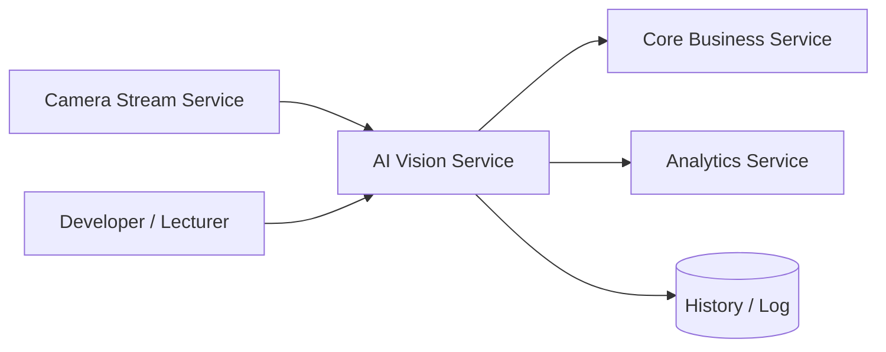

# Service Boundary của nhóm

## 1. Thông tin nhóm

- Tên nhóm: 10
- Lớp: CNTT 17-09
- Thành viên:
  - Trịnh Việt Đức
  - Nguyễn Quang Đạt
  - Lê Quang Dũng
- Service nhóm phụ trách: AI Vision Service
- Sản phẩm tổng thể của lớp: Smart Campus Operations Platform

## 2. Actor

- Camera Stream Service: gửi ảnh hoặc frame cần phân tích.
- Core Business Service: nhận kết quả AI để ra quyết định nghiệp vụ.
- Analytics Service: lấy dữ liệu phát hiện để tổng hợp thống kê.
- Người phát triển/giảng viên: kiểm tra endpoint, test report và minh chứng chạy được.

## 3. System Boundary

Nhóm em xây phần AI Vision độc lập trong Product A.

Phần nhóm kiểm soát:

- Nhận request phân tích ảnh/frame.
- Kiểm tra dữ liệu đầu vào hợp lệ.
- Xử lý ảnh bằng mô hình AI thật hoặc mô phỏng kết quả AI.
- Trả về kết quả phát hiện và mức độ tin cậy.
- Lưu lịch sử phân tích tối thiểu để phục vụ debug hoặc thống kê.

Phần nhóm chỉ tích hợp:

- Nhận ảnh từ Camera Stream Service.
- Gửi kết quả bất thường sang Core Business Service.
- Cung cấp dữ liệu phát hiện cho Analytics Service.

## 4. Service Boundary

Service của nhóm có trách nhiệm:

- Nhận ảnh từ Camera Stream Service qua URL hoặc payload mô phỏng.
- Phân tích đối tượng trong ảnh, ví dụ person, unknown person hoặc motion-related event.
- Trả về kết quả có cấu trúc rõ ràng để service khác dùng được ngay.
- Cung cấp trạng thái sức khỏe của service.

Service KHÔNG làm gì:

- Không quyết định cảnh báo cuối cùng, việc đó thuộc Core Business Service.
- Không gửi thông báo trực tiếp cho người dùng cuối.
- Không quản lý camera vật lý hay luồng video realtime.
- Không thay thế hoàn toàn hệ thống AI production nếu nhóm chỉ dùng mock AI.

## 5. Input / Output

### Input

- `camera_id`: mã camera hoặc khu vực camera.
- `image_url`: đường dẫn ảnh/frame cần phân tích.
- `timestamp`: thời điểm ghi nhận frame.
- `request_id`: mã yêu cầu để đối chiếu log và trace.

### Output

- `detected`: ảnh có phát hiện đối tượng hay không.
- `object`: đối tượng được phát hiện, ví dụ `person`.
- `confidence`: độ tin cậy của kết quả.
- `risk_level`: mức rủi ro gợi ý cho Core Business.
- `message`: mô tả ngắn kết quả phân tích.

## 6. API dự kiến

| Method | Endpoint | Mục đích |
|---|---|---|
| GET | /health | Kiểm tra service |
| POST | /v1/analyze | Gửi ảnh/frame để phân tích |
| GET | /v1/results/{request_id} | Tra cứu kết quả theo request |
| GET | /v1/history | Xem lịch sử phân tích gần nhất |

## 7. Phụ thuộc service khác

Service này gọi đến service nào?

- Không bắt buộc gọi service khác trong luồng tối thiểu.
- Nếu có kết nối mở rộng, service có thể đẩy kết quả sang Core Business Service.
- Analytics Service có thể lấy dữ liệu từ endpoint lịch sử hoặc từ log/artefact của service này.

Service nào gọi đến service này?

- Camera Stream Service là upstream chính.
- Core Business Service có thể gọi lại để lấy chi tiết kết quả nếu cần.
- Analytics Service có thể đọc lịch sử phân tích để tổng hợp metric.

## 8. Sơ đồ minh họa

Có thể vẽ bằng Mermaid, draw.io, Ludichart hoặc ảnh chụp sơ đồ.

